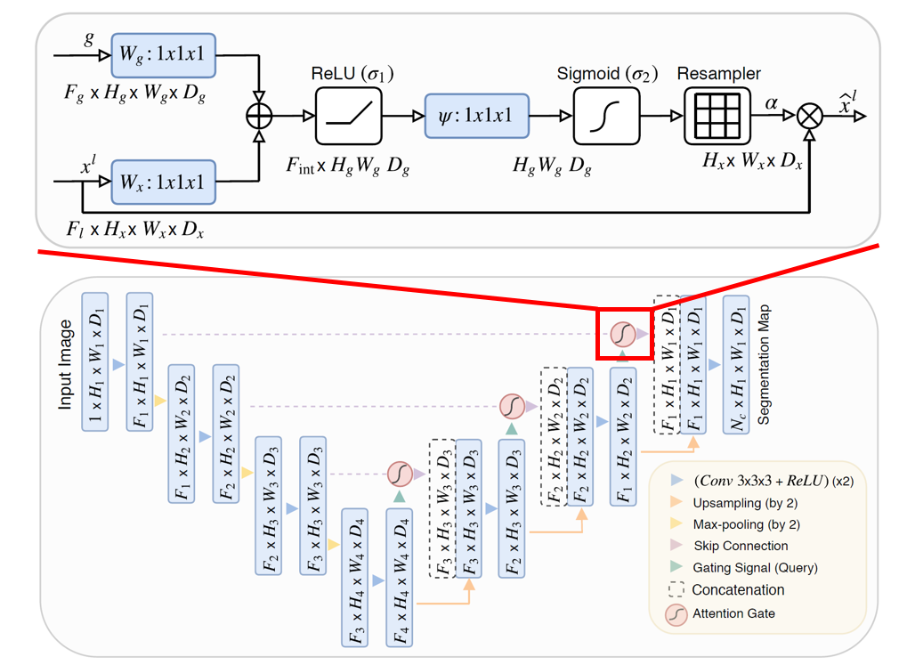
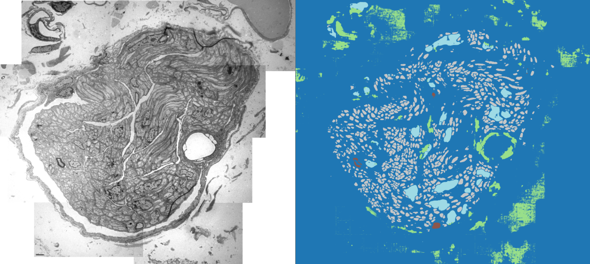
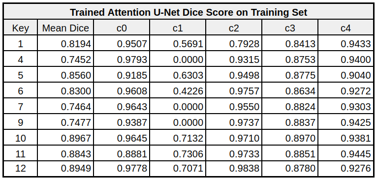
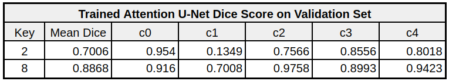

# TEM Cell Segmentation

Automatic multi-class cell segmentation on Transmission Electron Microscopy (TEM) grayscale images using an Attention U-Net trained on labeled HDF5 volumes.

## Visual overview
- Attention U-Net architecture:  
  
- Test set qualitative result:  
  

## Project overview
- Task: fully supervised semantic segmentation on high-resolution TEM images stored in HDF5 (`raw` and `label` groups per image key).
- Data handling: extract 512×512 patches with 256 stride from 11 labeled images; 9 train / 2 val split driven by shuffled keys.
- Model: Attention U-Net encoder–decoder; training loss = cross-entropy + Dice with augmentations (flips, rotations, mild affine/blur/downscale).
- Inference: slide a 512×512 window with overlap over full-resolution test images, average logits across overlaps, and stitch predictions.
- Results: mean Dice ≈ 0.8245 (train) and 0.7937 (val) across 5 classes; strong on background/large structures, reasonable on smaller classes.
- Data & weights: the Google Drive folder has train/test HDF5 files (`train_data.h5`, `train_data_downsampled.h5`, `test_data.h5`) plus `.pth` checkpoints (`tem_attention_unet_best.pth`, `tem_attention_unet_last.pth`): https://drive.google.com/drive/folders/1NY1EBmMQ1_Zz3s_5aNOMQH4hrBZHUh5m?usp=sharing

## Setup
```bash
python -m venv .venv
source .venv/bin/activate
pip install -r requirements.txt
```

## Training
Training defaults are configured in `train.py` (paths, patch size 512, stride 256, 150 epochs, early stopping). Update `h5_path` if your training HDF5 lives elsewhere.
```bash
python train.py
```
Checkpoints and `loss_history.json` are written in the repo root; adjust model choice in `train.py` if you prefer another UNet variant.

## Results
- Training mean and per-class Dice:  
  
- Validation mean and per-class Dice:  
  

## Inference
Place a trained weight file (e.g., `tem_attention_unet_best.pth`) in the project root, point `test_h5_path` in `prediction.py` to your test set, and run:
```bash
python prediction.py
```
Predictions are saved under `predictions/` as both `.npy` arrays and `.png` visualizations (`*_img.*` for inputs, `*_pred.*` for masks).
